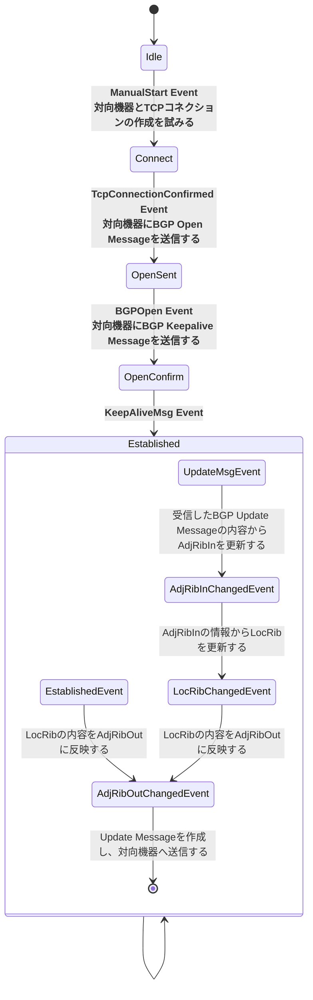

# GOでBGPを実装
"作って学ぶルーティングプロトコル　RustでBGPを実装"を参考に、Go言語でBGPを実装していく。
- https://nextpublishing.jp/book/15905.html
- https://github.com/Miyoshi-Ryota/how-to-create-bgp
- https://github.com/Miyoshi-Ryota/mrbgpdv2

## 実装の段階
以下の段階に分けてイベント駆動ステートマシンとしてBGPを実装していく。
なお、正常系のみ実装する。
1. "Connect"まで遷移する実装
2. "Established"まで遷移する実装
3. "Update Message"を交換する実装

## BGPのイベント駆動ステートマシンに登場するEvent   (本書から抜粋)
|Event名|説明|
|---|---|
|ManualStart|BGPの開始を指示したときに発行されるイベント。 RFCないでも同様に定義されている。|
|TcpConnectionConfirmed|対向機器とTCPコネクションを確率できたときに発行されるイベント。 RFC内でも同様に定義されている。 RFCでは、TCP ackを受信したときのイベント、TcpCrAckedと区別している。 しかし本書では正常系しか実装しないため、TCPコネクションが確立された時のイベントとしては本イベントのみにしている。|
|BGPOpen|対向機器からOpen Massageを受信したときに発行されるイベント。 RFC内でも同様に定義されている。|
|KeepAliveMsg|対向機器からKeepAlive Massageを受信したときに発行されるイベント。 RFC内でも同様に定義されている。|
|UpdateMsg|対向機器からUpdate Messageを受信したときに発行されるイベント。 RFC内でも同様に定義されている。|
|Established|Established Stateに遷移したときに発行されるイベント。 存在するほうが実装しやすいため追加した。 RFCには存在しないイベント。|
|LocRibChanged|LocRibが変更がされたときに発行されるイベント。 存在するほうが実装しやすいため追加した。 RFCには存在しないイベント。|
|AdjRibInChanged|AdjRibInが変更がされたときに発行されるイベント。 存在するほうが実装しやすいため追加した。 RFCには存在しないイベント。|
|AdjRibOutChanged|AdjRibOutが変更がされたときに発行されるイベント。 存在するほうが実装しやすいため追加した。 RFCには存在しないイベント。|

## BGPのイベント駆動ステートマシンに登場するState   (本書から抜粋)
|State名|説明|
|---|---|
|Idle|初期状態|
|Connect|TCPコネクションの確立を待機している状態|
|OpenSent|PeerからのOpen Messageを待機している状態|
|OpenConfirm|PeerからのKeepAlive Messageを待機している状態|
|Established|Peerが正常に確立され、Update Messageなどのやり取りが可能になった状態|

## BGPのステートマシン
